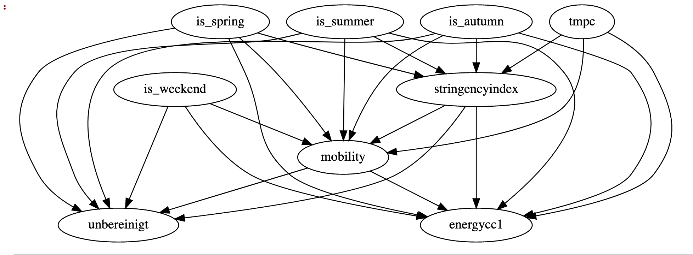

# Code from Workstream 2: Emergent Pulse 

The aim of this workstream is to create a series of index that can describe the status of a region, for example: How is the tourism industry being affected?

## Airport Restrictions

The folder - airport_restrictions contain the analysis done on NOTAM data and travel restriction data from Humanitarian exchange to extract quarantine and country restrictions. Please note that this folder contains only code and the NOTAM data will have to be downloaded manually. The following provides a brief overview of the different notebooks available in the folder:

* ws2_snr_NOTAMs_1_data_preparation.ipynb - Basic preprocessing of NOTAM - removing special characters, expanding abbreviations, removing stop words.
* ws2_snr_NOTAMs_2_topic_modeling.ipynb -  Identification of different topics present in the NOTAM.
* ws2_snr_notams_3_quarantine_text.ipynb -  Extraction of quarantine duration from NOTAM using Named Entity Recognition (NER) and regex.
* ws2_snr_NOTAMs_1_data_preparation_mulitple files.ipynb - Similar to the first notebook on data preparation. Iteration of data preprocessing to multiple files.
* ws2_snr_NOTAMs_country_level_restrictions_timeline.ipynb - Information extraction of restriction on foreigners using NER, Part of speech tagging and dependency parser.
* ws2_snr_humdata_country_level_restriction_timeline.ipynb - Information extraction of restriction on foreigners using the same set of rules used in the above notebook on a different data source (travel restriction data from humanitarian exchange)
* ws2_snr_validation_information_extraction_rules.ipynb - validation of the information extraction rules based on the results generated using NOTAM and travel restriction data from humanitarian exchange
* ws2_snr_travel_advisory_data_download.ipynb - travel risk index from travel-advisory website that provides a travel risk index for each country based on the travel advisories from different foreign countries.

Named Entity Recognizer was used to identify country names mentioned in the data.

Part of speech tagging was used to identify the verbs in the sentences and rules were used to determine if the verb had a positive or negative connotation.

## Airbnb analysis

The Airbnb folder contains the analysis done on the InsideAirbnb data: http://insideairbnb.com/get-the-data.html. The aim of this analysis is to offer data-driven insights into the new trends in tourism and hospitality. The following summarises the content of Airbnb notebooks.

* Predictive_Model.ipynb - Predictive model using FBProphet that characterizes the expected Airbnb demand if Covid-19 pandemic did not happen. 
* Geo_Distribution_Tourism.ipynb - Geo distribution of the Airbnb demand in cities around the world.

## Mobility estimator analysis

Causal inference of stringency measures on mobility. We use Microsoft's DoWhy library to carry out the causal inference analysis. The following gives an overview of the notebooks:

* CA_Mobility_Weather_Countermeasures.ipynb - Investigate the effect of countermeasures /lockdown on mobility data.
* CA_dowhy multiple scenarios_weekend_encoding.ipynb - Try out different hypothesis to investigate the effect of lockdown measures on mobility
* CA_dowhy_validation_weekend_encoding.ipynb - Build a mobility estimator model using the causal estimator function and validate the model

## CA_Causal_structure_discovery_economic_impact.ipynb

Investigate the effect of lockdown measures on economy. To identify economic activity we consider data sets such as electricity consumption and heavy truck toll movement data. As trucks are mainly used to transport goods their movement data helps in estimating the current economic activity.

## Team

IBM:
* **Mehrnoosh Vahdat** is Data Scientist with Data Science & AI Elite team where she specializes in Data Science, Analytics platforms, and Machine Learning solutions.
* **Vincent Nelis** is Senior Data Scientist with Data Science & AI Elite team where he specializes in Data Science, Analytics platforms, and Machine Learning solutions.
* **Anthony Ayanwale** is Data Scientist with CPAT team where he specializes in Data Science, Analytics platforms, and Machine Learning solutions.   
* **Álvaro Corrales Cano** is a Data Scientist within IBM's Cloud Pak Acceleration team. With a background in Economics, Álvaro specialises in a wide array Econometric techniques and causal inference, including regression, discrete choice models, time series and duration analysis.
* **Ananda Pal** is a Data Scientist and Performance Test Analyst at IBM, where he specialises in Data Science and Machine Learning Solutions.

Rolls Royce:
* **Shri Nishanth Rajendran** - AI Development Specialist, R² Data Labs, Rolls Royce
* **Deepak Shankar Srinivasan** - AI Development Specialist, R² Data Labs, Rolls Royce
* **Maria Ivanciu** is AI Developer in R2 Data Labs, Rolls-Royce. 
