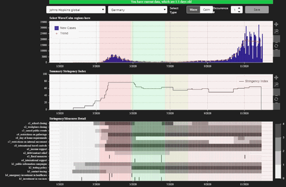
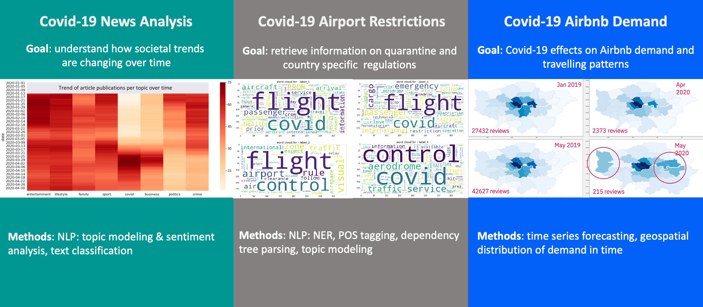

# Workstreams

The _Regional Risk-Pulse Index_ project is organised into three broad thematic categories or workstreams:
* **WS1 - Emergent Risk Index.** When is it the right time for local authorities to intervene based on the health status of a region?
* **WS2 - Emergent Pulse.** How are people feeling and behaving as a result of the measures against Covid-19? 
* **WS3 - Economic Scenario Modelling.** How are shocks to specific industrial sectors affect the whole economy (restaurant shutdowns, air travel restrictions, etc)? 
Under these thematic categories, we have developed a wide array of interconnected analyses which are outlined below. 

# WS1 - Emergent Risk Index
## Health Risk Index
A composed regional risk index that takes into account the level of infection rate, % of vulnerable population, and many other factors to assess the ‘riskiness’ of a specific region. How can we help local authorities to decide when is the right time to intervene? 

## Geospatial
A geospatial knowledge of the world with respect to neighbourhood relationships at country and sub-country level. It includes a [Jupyter notebook](ws1/geospatial/WS3_kp_Knowledge_Graph.ipynb) that executes parallel threads without the need for a running `ipyparallel` instance , see computation of neighbours at the bottom

## Labelling tool
A tagging tool for humans to annotate infection waves.

# WS2 - Emergent Pulse
This image gives an overview of some of the topics covered in this workstream

## News Analysis
This analysis looks at what are the main topics covered in newspaper articles during the onset of the pandemic in the UK. It includes topic modelling and sentiment analysis of text. 

## Social Media Analysis
Stemming from the News Analysis and part of our collaboration with the NHS in Nottinghamshire, here we use data from Twitter to look at the perception of vaccines and lockdown measures in the Nottingham area, as well as mental wellness. This analysis includes:
* Topic modelling
* Sentiment and emotion analysis 
* Identification of popular tweets and influencers in the local area

## Mobility and Tourism
Here we use NOTAMS data to extract information on international travel restrictions to and from several countries. We also use Airbnb data to study how travelling patterns changed in the UK after the onset of the pandemic. 

# WS3 - Economic Scenario Modelling
We create an economic scenario modelling tool, the Emergent Economic Engine, to simulate how shocks to some industries may propagate to the rest of a networked economy. These shocks can be in the form of sectorial shutdowns, travel restrictions. The tool also offeres the possibility of counteracting these measures by injecting resources into the economy. 

