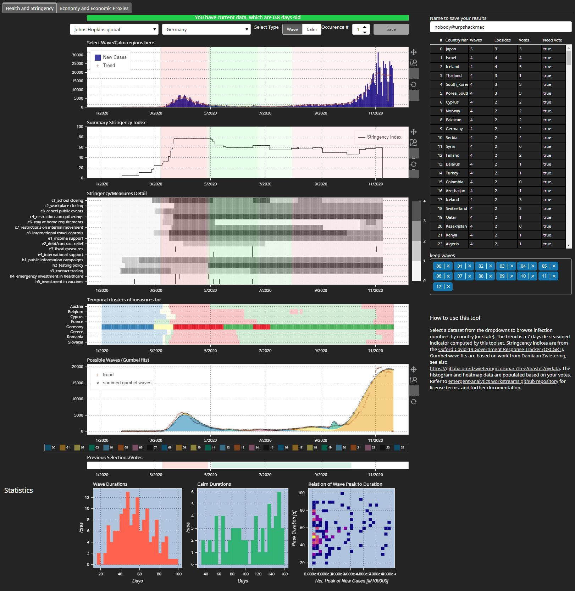
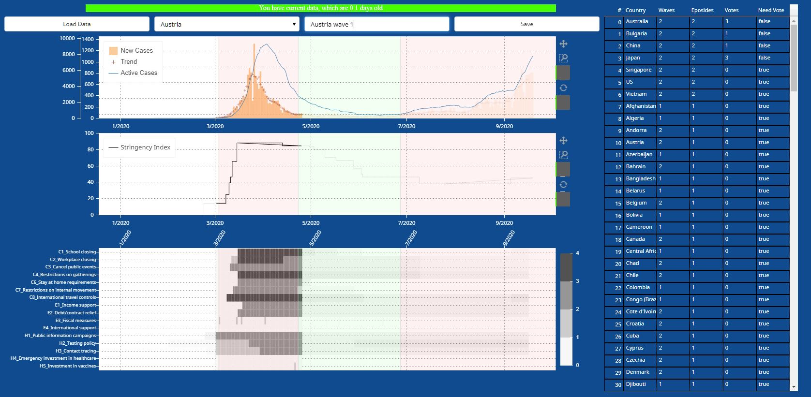
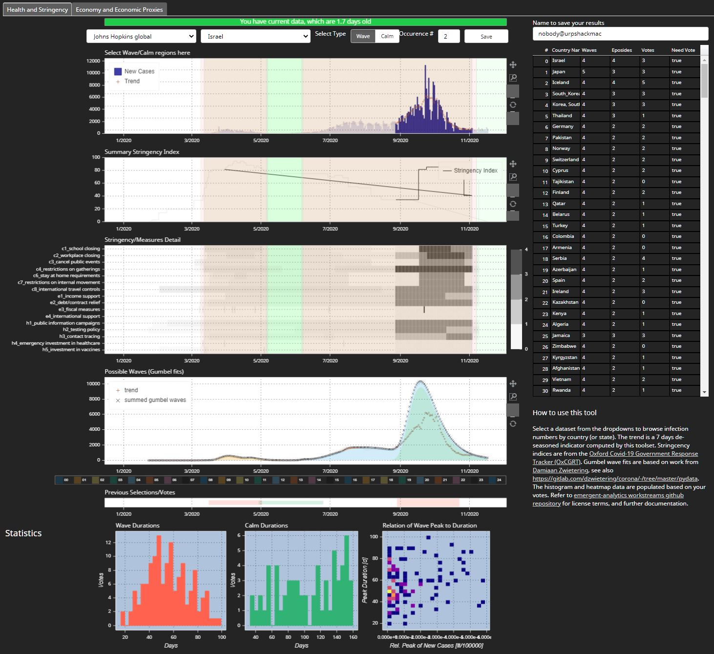

---this file is under review---

# CookieCutter

CookieCutter tool to select from various sources and 
[Oxford Covid-19 Government Response Tracker (OxCGRT)](https://github.com/OxCGRT/covid-policy-tracker) in order
to be able to understand compare COVID-19 infection waves and periods of quiet together with changes
to country wide policies. In addition, a second tab provides the ability to model economic shocks to the economy by overlaying a data editor with reference data sets.

This tool has been written very fast without too much consideration on code quality or maintainability,
as a Minimum Viable Product to understand the features actually required to make such a tool useful.

Its contains a crude detection of infection wave(s) and periods of quiet, based on continually growing or decreasing 
(and levelling off) of new reported cases of infection data.

The author understands there are other, country level data sources with at times higher quality, definitely
different numbers, but the purpose of the tool is to collect infection waves using human ingenuity, and
precision is probably not required for this task initially.

## Setup

Clone the repository. You will need the python bokeh package, best installed using `conda install bokeh`, although
it is part of any [anaconda distribution](https://www.anaconda.com/products/individual). Also ensure you have 
[`statsmodels`](https://pypi.org/project/statsmodels/) installed. In addition to that, we need the amazing 
[pycountry](https://pypi.org/project/pycountry/) package installed, which is a perfect resource for country name
and ISO country code mapping, and, last but not least, a library such as [xlrd](https://pypi.org/project/xlrd/) to
read the United Nations population datafile with forecasted numbers for 2020. We actually recommend to run the docker image as we also need the [sklearn-contrib-py-earth](https://pypi.org/project/sklearn-contrib-py-earth/) package which can be a challenge to install.

## Running

If deploying in standalone mode, change into this directory, then, in a console
```
bokeh serve cookiecutter --allow-websocket-origin"*" -address 0.0.0.0
```
then, from a web browser, enter
```
http://<machine_name>:5006/cookiecutter
```

For standalone mode, you will need to specify a SQLalchemy sql database for persistence, sqlite3 could be an option, too.

## Docker

Change into this directory, then (after editing .env as required although it contains a good default, see below)
```
mv .env.docker-compose .env
docker-compose build
docker-compose up
```
If you want to run this in the background, use `docker-compuse up -d`.

The app is now available on
```
http://<machine_name>:8080
```

To change the publically available port number from 8080, and to allow for persistence of the storage, there exists a file named .env which 
defines these two entries.

```
DATA_FOLDER=./data
PUBLIC_WEBSERVER_PORT=8080
```

See [the data files description)[#data-files] at the end of this document.

The container image also ships with an installation of postgres to persist data. We map the postgres port to 15432 by default. You can specify another database backend via a config variable using SQLalchemy style connect strings, note the image only has drivers for postgres and db2 at the moment.

## Helper Notebooks

The folder helper_notebooks contain jupyter notebooks which are used to download data. We deliberately removed download functionality from the tool as some of the web data sources may cease to exist over time, so users would get notified and could edit the notebooks as required.

## UI



Basic screenshot.

UI Elements are
* a top status bar which initially displays how old the underlying data are, or if there was an issue locating it. When running the
  app for the first time, press "Load Data". When running locally you will see a list of countries as their associated data are preprocessed.
  TODO: Provide a feedback/reload the page as the docker variant does not provide user feedback except the first dataset
  being displayed (see bottom screenshot for initial screen)
* The dropdown boxes allow the selection of data sets and countries
* A radio button and Occurence number spinner to label the selections as "Wave" or a period of "Calm"ness, and number them. The author
  uses Wave1-Calm1-Wave2 etc, but this is merely a way to structure one's data
* A save button which becomes active when the user made a selection
* The top time series plot shows bars representing new cases reported, a smoothed trend line to counteract weekend phenomena, and a total
 active cases line, for the selected country
* the center time series shows the ["Stringency Index for Display" value](https://github.com/OxCGRT/covid-policy-tracker/blob/master/documentation/codebook.md)
* the grey heatmap details [which measures were taken](https://github.com/OxCGRT/covid-policy-tracker/blob/master/documentation/codebook.md)
* the wave data use the algorithms developed by D. Zwietering [here](https://pydata.org/eindhoven2020/schedule/presentation/15/building-a-coronaradar/)
* the band below the grey heatmap shows previous labelling data (aka Votes). Deletion of previous votes needs to be done via the file system.
  The height of the bands is randomly chosen and has no further meaning.
* a text entry field that allows for capturing a user identity, this is useful if a team of people are asked to label the data
* The table to the right gives a synposis of which countries have been voted on and which may need a vote. While this is being re-engineered,
 it will only be updated after pressing F5 or page refresh
* At the bottom, there are two histograms and one heatmap which illustrate the labelling/voting results for how long Waves or periods of Calm
  take, and if and how wave peaks (normalized by 100000 population of a country) scale with duration (hint: they are not)



Selection of an episode (Israel WAVE 2) and naming/classifying it (see the selections of the radio buttons).




Saving a selected episode, in this case, Australia WAVE 2. After pressing "Save" the status bar will display the table the vote is saved to, together with a wave_id.

| Column Name | Description |
|---------------------------|---------------------------|
| c1_school closing | OxCGRT flag [Codebook](https://github.com/OxCGRT/covid-policy-tracker/blob/master/documentation/codebook.md) for selected time range |
| c2_workplace closing | OxCGRT flag [Codebook](https://github.com/OxCGRT/covid-policy-tracker/blob/master/documentation/codebook.md) for selected time range |
| c3_cancel public events | OxCGRT flag [Codebook](https://github.com/OxCGRT/covid-policy-tracker/blob/master/documentation/codebook.md) for selected time range |
| c4_restrictions on gatherings | OxCGRT flag [Codebook](https://github.com/OxCGRT/covid-policy-tracker/blob/master/documentation/codebook.md) for selected time range |
| c6_stay at home requirements | OxCGRT flag [Codebook](https://github.com/OxCGRT/covid-policy-tracker/blob/master/documentation/codebook.md) for selected time range |
| c7_restrictions on internal movement | OxCGRT flag [Codebook](https://github.com/OxCGRT/covid-policy-tracker/blob/master/documentation/codebook.md) for selected time range |
| c8_international travel controls | OxCGRT flag [Codebook](https://github.com/OxCGRT/covid-policy-tracker/blob/master/documentation/codebook.md) for selected time range |
| e1_income support | OxCGRT flag [Codebook](https://github.com/OxCGRT/covid-policy-tracker/blob/master/documentation/codebook.md) for selected time range |
| e2_debt/contract relief | OxCGRT flag [Codebook](https://github.com/OxCGRT/covid-policy-tracker/blob/master/documentation/codebook.md) for selected time range |
| e3_fiscal measures | OxCGRT flag [Codebook](https://github.com/OxCGRT/covid-policy-tracker/blob/master/documentation/codebook.md) for selected time range |
| e4_international support | OxCGRT flag [Codebook](https://github.com/OxCGRT/covid-policy-tracker/blob/master/documentation/codebook.md) for selected time range |
| h1_public information campaigns | OxCGRT flag [Codebook](https://github.com/OxCGRT/covid-policy-tracker/blob/master/documentation/codebook.md) for selected time range |
| h2_testing policy | OxCGRT flag [Codebook](https://github.com/OxCGRT/covid-policy-tracker/blob/master/documentation/codebook.md) for selected time range |
| h3_contact tracing | OxCGRT flag [Codebook](https://github.com/OxCGRT/covid-policy-tracker/blob/master/documentation/codebook.md) for selected time range |
| h4_emergency investment in healthcare | OxCGRT flag [Codebook](https://github.com/OxCGRT/covid-policy-tracker/blob/master/documentation/codebook.md) for selected time range |
| h5_investment in vaccines | OxCGRT flag [Codebook](https://github.com/OxCGRT/covid-policy-tracker/blob/master/documentation/codebook.md) for selected time range |
| datetime_date | datetime of selected data point(s) |
| new_cases | number of new cases reported at that datetime for the selected country from the selected dataset |
| new_cases_rel | number of new cases reported divided by population (in 100000) at that datetime for the selected country from the selected dataset |
| trend | trend for new cases reported, 7 day seasonality removed to cater for weekend lack of data |
| stringencyindex | OxCGRT StringencyIndexForDisplay [Codebook](https://github.com/OxCGRT/covid-policy-tracker/blob/master/documentation/codebook.md) for selected time range |
| rel_peak_new_cases | max of new_cases_rel |
| kind | one of "wave" or "calm", extension to "onset" under consideration to mark up initial waves |
| kind_counter | number as entered on the UI |
| from_dt | selection range from datetime |
| to_dt | selection range to datetime |
| duration | in days |
| user | user name as entered in the UI |
| identifier | ISO 3166-1 short three character country code, or a synthesis of two character country and two character postal/ISO code for state (e.g. US-NC, DE-BY) |
| vote_datetime | datetime the vote was made |
| vote_id | running number of vote |


## Data Files

* Documentation will be provided for the dockerized database.

## Disclaimer

Disclaimer: This information can be used for educational and research use. The author is not a health care professional and it is not recommended to use the views in this document for any healthcare related decision making.
