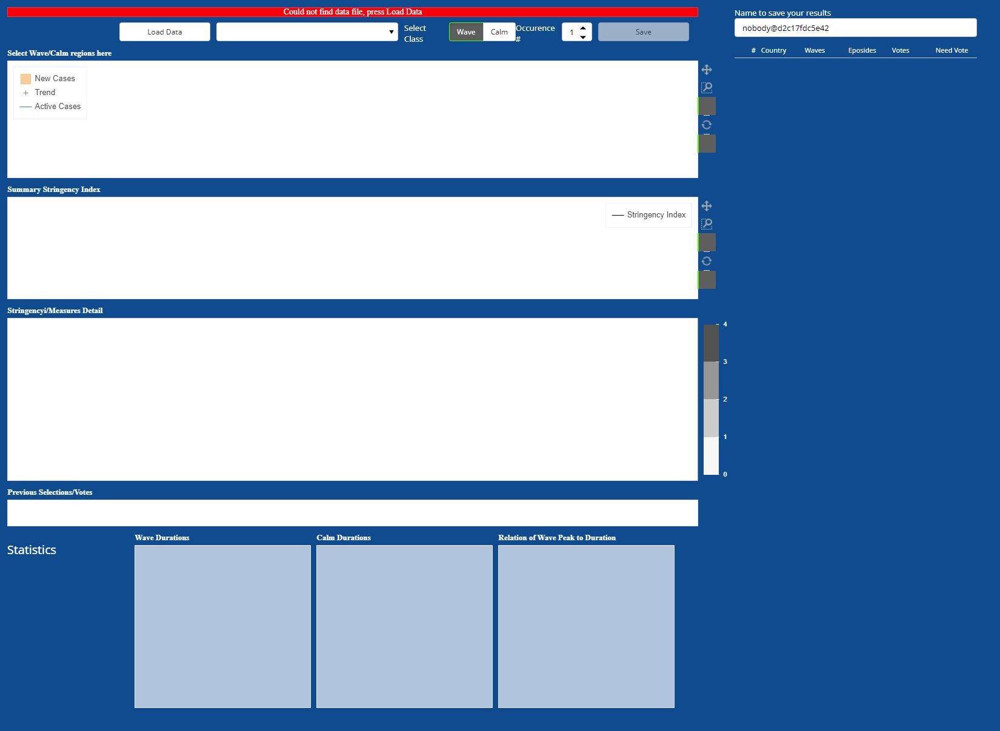

# CookieCutter

CookieCutter tool to select from (currently) [Johns Hokpins](https://github.com/CSSEGISandData/COVID-19) and 
[Oxford Covid-19 Government Response Tracker (OxCGRT)](https://github.com/OxCGRT/covid-policy-tracker) in order
to be able to understand compare COVID-19 infection waves and periods of quiet together with changes
to country wide policies.

This tool has been written very fast without too much consideration on code quality or maintainability,
as a Minimum Viable Product to understand the features actually required to make such a tool useful.

Its contains a crude detection of infection wave(s) and periods of quiet, based on continually growing or decresing 
(and levelling off) of new reported cases of infection data.

The author understands there are other, country level data sources with at times higher quality, definitely
different numbers, but the purpose of the tool is to collect infection waves using human ingenuity, and
precision is probably not required for this task initially.

## Setup

Clone the repository. You will need the python bokeh package, best installed using `conda install bokeh`, although
it is part of any [anaconda distribution](https://www.anaconda.com/products/individual). Also ensure you have 
[`statsmodels`](https://pypi.org/project/statsmodels/) installed. In addition to that, we need the amazing 
[pycountry](https://pypi.org/project/pycountry/) package installed, which is a perfect resource for country name
and ISO country code mapping, and, last but not least, a library such as [xlrd](https://pypi.org/project/xlrd/) to
read the United Nations population datafile with forecasted numbers for 2020.

## Running

If deploying in standalone mode, change into this directory, then, in a console
```
bokeh serve cookiecutter --allow-websocket-origin"*" -address 0.0.0.0
```
then, from a web browser, enter
```
http://<machine_name>:5006/cookiecutter
```

At the moment, the tool will download also rather static data such as the UN population table, which is consuming
unnecessary bandwidth and resources. Also, if URLs change, it would not revert to an existing data source.

Migrating to a (No)SQL datastore or persistence approach would be the right thing to do, but given the limited useful
time for this tool, effort has been spent on the UI and its functionality.

## Docker

Change into this directory, then (after editing .env as required although it contains a good default, see below)
```
mv .env.docker-compose .env
docker-compose build
docker-compose up
```
If you want to run this in the background, use `docker-compuse up -d`.

The app is now available on
```
http://<machine_name>:8080
```

To change the publically available port number from 8080, and to allow for persistence of the storage, there exists a file named .env which 
defines these two entries.

```
DATA_FOLDER=./data
PUBLIC_WEBSERVER_PORT=8080
```

See [the data files description)[#data-files] at the end of this document.

## UI


Basic screenshot.

UI Elements are
* a top status bar which initially displays how old the underlying data are, or if there was an issue locating it. When running the
  app for the first time, press "Load Data". When running locally you will see a list of countries as their associated data are preprocessed.
  TODO: Provide a feedback/reload the page as the docker variant does not provide user feedback except the first dataset
  being displayed (see bottom screenshot for initial screen)
* "Load Data" downloads the data from the github repos
* The dropdown box allows the selection of countries, it is sorted by the percentage increase of new cases, i.e. countries with high
 infection growth rates should be at the top. It is still possible to type the desired country name when the dropdown widget is seletced
* A radio button and Occurence number spinner to label the selections as "Wave" or a period of "Calm"ness, and number them. The author
  uses Wave1-Calm1-Wave2 etc, but this is merely a way to structure one's data
* A save button which becomes active when the user made a selection
* The top time series plot shows bars representing new cases reported, a smoothed trend line to counteract weekend phenomena, and a total
 active cases line, for the selected country
* the center time series shows the ["Stringency Index for Display" value](https://github.com/OxCGRT/covid-policy-tracker/blob/master/documentation/codebook.md)
* the grey heatmap details [which measures were taken](https://github.com/OxCGRT/covid-policy-tracker/blob/master/documentation/codebook.md)
* the band below the grey heatmap shows previous labelling data (aka Votes). Deletion of previous votes needs to be done via the file system.
  The height of the bands is randomly chosen and has no further meaning.
* a text entry field that allows for capturing a user identity, this is useful if a team of people are asked to label the data
* The table to the right gives a synposis of which countries have been voted on and which may need a vote. While this is being re-engineered,
 it will only be updated after pressing F5 or page refresh
* At the bottom, there are two histograms and one heatmap which illustrate the labelling/voting results for how long Waves or periods of Calm
  take, and if and how wave peaks (normalized by 100000 population of a country) scale with duration (hint: they are not)


Selection of an episode (Australia WAVE 1) and naming/classifying it (see the selections of the radio buttons).


Saving a selected episode, in this case, Australia WAVE 2. After pressing "Save" the status bar will display the filename,
which will look like
```
BGR.Bulgaria.Wave.1.20200320.20200527.nobody.csv
```
which is a full stop separated field with the following information

|Field No|Meaning                          |
|--------|---------------------------------|
| 0      | ISO 3166-1 alpha-3 country code |
| 1      | [Country name](https://schema.org/Country), note this may contain blank characters |
| 2      | Kind of episode, currently `Wave|Calm`, may be extended to `Onset` so that new waves can be captured |
| 3      | running number of episode, the author uses Wave 1, Calm 1, Wave 2, but there is no semantics to the number other than discriminating two waves |
| 4      | starting date of the selected episode YYYYMMDD |
| 5      | end date of the selected episode YYYYMMDD |
| 6      | user name as entered, this will be populated with `nobody@<machine_name>` and can be edited. Used to allow multiple votes if deemed useful |




Screenshot when starting from scratch. Press "Load Data" and follow the screen outputs when running locally, or wait for the first dataset
for Germany to be displayed.

## Data Files

The data folder contains three classes of files:-
* one or more csv files which contain the selected data for the eposides. Apologies for deferring a description to a later date,
  it is using pieces of [OxCGRT data](https://github.com/OxCGRT/covid-policy-tracker/blob/master/documentation/codebook.md),
  fused [Johns Hopkins Data](https://github.com/CSSEGISandData/COVID-19/tree/master/csse_covid_19_data), and some [derived 
  data partially described in some very old work](https://klausgpaul.github.io/)
* a `votes.pickle` file which contains an aggregation of the above csv files, using [python pickle protocol 3](https://docs.python.org/3/library/pickle.html#data-stream-format),
  some python 3.8 adopters may have encountered that protocol issue...
* a `datafile.pckld.gz` file which is probably too much of a masterpiece of storing complex data, it is a compressed,
  dict that contains base64 encoded pickled data, which renders it very incompatible between machines and pandas etc. versions
  This project reused data structres from another [rapidly developed](https://got-data-for.me) COVID-19 related dashboard.

## Disclaimer

Disclaimer: This information can be used for educational and research use. The author is not a health care professional and it is not recommended to use the views in this document for any healthcare related decision making.
